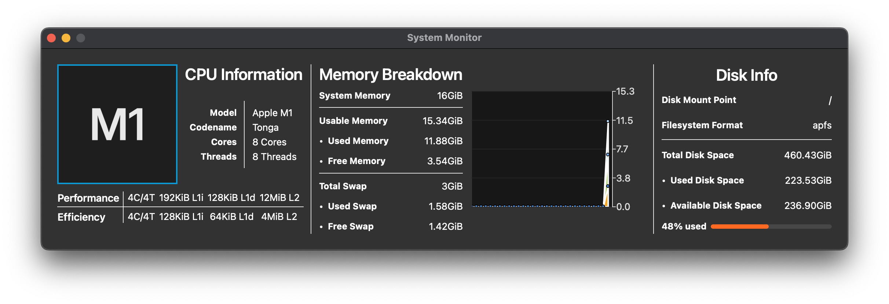

# System Monitor



AI Disclaimer: I used Claude Code after creating the entire codebase to add error checking where there previously was
none and clean up dead code. I also used it to create the CI/CD

System Monitor is a utility which attempts to expose information about your computer which is otherwise not exposed in a
central GUI. Think of it is an alternative to Activity Monitor on macOS or Task Manager on Windows.

Currently, this is more of a tech demo than a complete piece of software. It displays CPU, Memory and Disk information
on
Apple Silicon based devices. It hasn't been tested on Intel Macs and doesn't have any codebase to make it function on
Windows or Linux.

## Features

- **CPU**
  - Model and Apple codename
  - Physical cores and logical threads
  - Core and thread counts
  - L1i, L1d, and L2 cache sizes
- **Memory**
  - Total and usable RAM
  - App, Wired, and Compressed memory
  - Swap usage
- **Disk**
  - Root filesystem mount point
  - Filesystem format
  - Total, used, and available space
  - Used percentage

## Installation

You can download a prebuilt `System-Monitor.app` from the [Releases](https://github.com/Protract-123/System-Monitor/releases) page.
You'll need to force the app to run on macOS since it isn't signed. To do this launch the app, and then go to"Privacy & Security" in macOS settings and allow it to run.

## Building from Source

Building requires:

- Go 1.25 or later
- Qt 6 (required by [miqt](https://github.com/mappu/miqt))
- A C++17 capable toolchain for CGO

The included [Makefile](Makefile) provides the common entry points:

```sh
make run                    # build and run
make build                  # produce the `system-monitor` binary
make app VERSION=0.1.0      # produce a self-contained System-Monitor.app bundle
make install                # install via `go install`
```

For more detail on building miqt-based projects (including how to install Qt 6 on your platform), refer to
[miqt's documentation](https://github.com/mappu/miqt).
